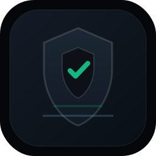
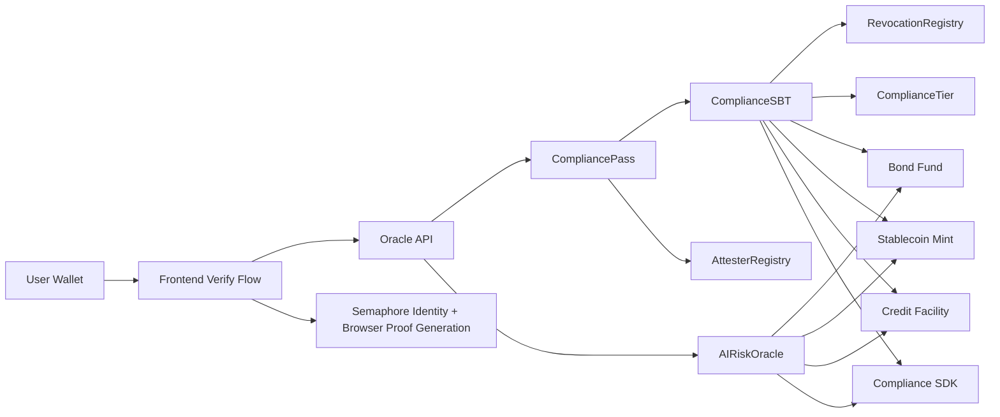
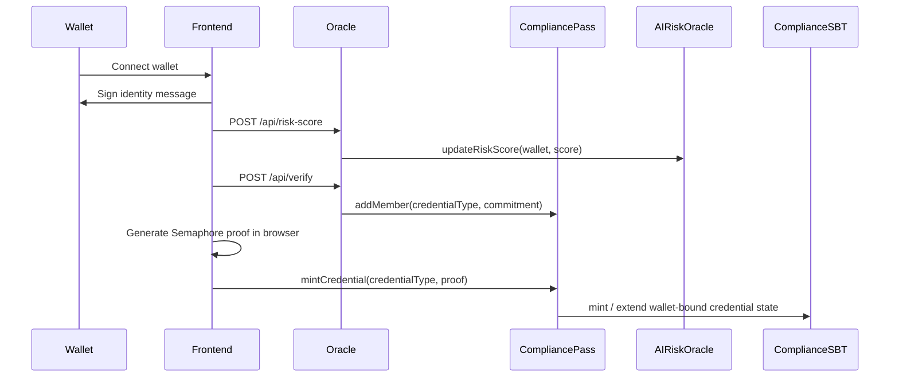

# HashKey CompliancePass

<p align="center">
  
</p>

<p align="center">
  Programmable compliance infrastructure for HashKey Chain.
</p>

<p align="center">
  Wallet-bound credentials • Zero-knowledge proofs • AI risk oracle • Protocol gating • Portable VC export
</p>

## What This Is

CompliancePass turns compliance into a reusable network primitive instead of a protocol-by-protocol bottleneck.

Users verify once, hold a wallet-bound Soulbound credential, and unlock compliant products without repeatedly exposing personal data. Protocols integrate a shared access-control layer. Attesters stake and issue. AI agents can evaluate live eligibility before capital moves.

## Live Surface

- Production app: `https://compliancepass.vercel.app`
- HashKey testnet RPC: `https://testnet.hsk.xyz`
- HashKey explorer: `https://testnet-explorer.hsk.xyz`
- Demo wallet: `0x94c188F8280cA706949CC030F69e42B5544514ac`

## Why It Matters

- Privacy: identity stays off-chain; proofs and access state settle on-chain.
- Reusability: one credential package can unlock multiple compliant products.
- Regulator fit: analytics and revocation visibility stay aggregate-first.
- Agent readiness: SDK + oracle + protocol requirement layer produce deterministic allow/block decisions.
- Ecosystem leverage: licensed attesters become reusable infrastructure providers, not one-off gatekeepers.

## Product Surfaces

- `frontend/`
  - `/`
  - `/verify`
  - `/demo`
  - `/dashboard`
  - `/credential`
  - `/docs`
- `oracle/`
  - `GET /health`
  - `POST /api/verify`
  - `POST /api/risk-score`
  - `GET /api/vc/:address`
  - `GET /api/attesters`
  - `GET /api/analytics`
- `sdk/`
  - agent-facing compliance reads and protocol eligibility checks

## Architecture



### On-Chain

- `AttesterRegistry.sol`
  - stake-backed attester registration and approval
- `CompliancePass.sol`
  - Semaphore group management and credential mint orchestration
- `ComplianceSBT.sol`
  - wallet-bound credential token with bitmask and expiry model
- `AIRiskOracle.sol`
  - wallet-level AI risk signal layer
- `ComplianceTier.sol`
  - reusable tier computation
- `RevocationRegistry.sol`
  - revocation registry and reason codes
- Demo contracts
  - `MockGovernmentBondFund.sol`
  - `MockStablecoinMint.sol`
  - `MockCreditFacility.sol`

### Off-Chain

- Oracle API
  - verification, risk updates, VC export, analytics, attester discovery
- Frontend
  - Vite + React 18 + TypeScript + React Router + Tailwind CSS v4 + Framer Motion + wagmi/viem
- SDK
  - protocol requirement reads and agent-side participation decisions

## Verification Flow



## Live Testnet Deployment

Network:
- HashKey Chain Testnet
- Chain ID: `133`

Contracts:
- SemaphoreVerifier: [`0x1850d2a31CB8669Ba757159B638DE19Af532ba5e`](https://testnet-explorer.hsk.xyz/address/0x1850d2a31CB8669Ba757159B638DE19Af532ba5e#code)
- PoseidonT3: [`0x9db2e380f9100793ea71413224dD7C22F97aD91B`](https://testnet-explorer.hsk.xyz/address/0x9db2e380f9100793ea71413224dD7C22F97aD91B#code)
- Semaphore: [`0x536b31435bFAE994169181AcA9BAadC784555b4B`](https://testnet-explorer.hsk.xyz/address/0x536b31435bFAE994169181AcA9BAadC784555b4B#code)
- RevocationRegistry: [`0x6C6e9bC9cBd3f0A90D61E094b4997199B81A02d5`](https://testnet-explorer.hsk.xyz/address/0x6C6e9bC9cBd3f0A90D61E094b4997199B81A02d5#code)
- AttesterRegistry: [`0xB9F38E0180F62e80Be6ca44cE6202316FCcefEC9`](https://testnet-explorer.hsk.xyz/address/0xB9F38E0180F62e80Be6ca44cE6202316FCcefEC9#code)
- AIRiskOracle: [`0x1699c6ae317F1f3DECaE37B806c174C4D3CAE26e`](https://testnet-explorer.hsk.xyz/address/0x1699c6ae317F1f3DECaE37B806c174C4D3CAE26e#code)
- ComplianceSBT: [`0x8aE5480D7fFAADb5f8Ef99246562a61Da30cf7E7`](https://testnet-explorer.hsk.xyz/address/0x8aE5480D7fFAADb5f8Ef99246562a61Da30cf7E7#code)
- CompliancePass: [`0xdBB3d6e17b34C118BdFd9A73FaECA55C4E814B51`](https://testnet-explorer.hsk.xyz/address/0xdBB3d6e17b34C118BdFd9A73FaECA55C4E814B51#code)
- MockGovernmentBondFund: [`0xcD0915cb3423F6665C636d723648F78d88B81e52`](https://testnet-explorer.hsk.xyz/address/0xcD0915cb3423F6665C636d723648F78d88B81e52#code)
- MockStablecoinMint: [`0x110D5480D02e2501e7aB7a41cFBc565BdF4D818e`](https://testnet-explorer.hsk.xyz/address/0x110D5480D02e2501e7aB7a41cFBc565BdF4D818e#code)
- MockCreditFacility: [`0x0424981440717D4E445B63399e1B9bf17bD04e70`](https://testnet-explorer.hsk.xyz/address/0x0424981440717D4E445B63399e1B9bf17bD04e70#code)

## Validated Live State

Validated wallet:
- `0x94c188F8280cA706949CC030F69e42B5544514ac`

Credential state:
- Token ID: `1`
- Bitmask: `30`
- Tier: `3`
- Risk score: `25`

Demo state after latest validation:
- Bond deposits: `0.3 HSK`
- Stablecoin minted: `2000`
- Credit limit: `5000`

Latest write validations on `2026-04-15`:
- Risk-score update tx: `0x586a6e7cc1a415455c142821be73757691222574e0c0ebf24eb01a9f823655e0`
- Verify endpoint tx: `0x951aab3db687cefda2c0390c5c1f51494de31631dca7f834a87f8ff4a6350b1f`
- Bond deposit tx: `0x3f9363265d2dcb14d4946b7e73bbb67ed6df6f41532931dd7aa22b319b4cd3e1`
- Stablecoin mint tx: `0x0db25ac21403e2e6e40a98d8ce3ffdfe9738a6cd3c8b9d9a39669fe9957d7d59`
- Credit approval tx: `0x26df7f2d7f6a46c18af20625b1a6f70b817ed598f48315a6716de97f9ab17848`

## Repository Layout

```text
.
├── contracts/
│   ├── contracts/
│   ├── scripts/
│   ├── test/
│   └── deployed-addresses.json
├── oracle/
│   ├── index.ts
│   └── deployed-addresses.json
├── sdk/
│   ├── ComplianceAgent.ts
│   ├── scripts/live-e2e.js
│   └── deployed-addresses.json
└── frontend/
    ├── src/
    ├── public/
    ├── api/
    └── vercel.json
```

## Local Setup

### Prerequisites

- Node.js 20+
- `pnpm`

### Contracts

```bash
cd contracts
pnpm install
pnpm test
```

Optional testnet deploy:

```bash
PRIVATE_KEY=...
HASHKEY_RPC_URL=https://testnet.hsk.xyz
HASHKEY_EXPLORER_API_KEY=placeholder
ADMIN_PRIVATE_KEY=...
DEMO_WALLET_ADDRESS=0x0000000000000000000000000000000000000000
pnpm deploy:testnet
pnpm seed:testnet
```

### Oracle

```bash
cd oracle
pnpm install
PORT=3001 \
HASHKEY_RPC_URL=https://testnet.hsk.xyz \
ADMIN_PRIVATE_KEY=... \
ORACLE_SIGNING_PRIVATE_KEY=... \
EVENT_LOOKBACK_BLOCKS=500000 \
pnpm start
```

### Frontend

```bash
cd frontend
pnpm install
pnpm dev
pnpm build
```

### SDK Live Validation Runner

```bash
cd sdk
TESTNET_PRIVATE_KEY=... node ./scripts/live-e2e.js
```

## Demo Walkthrough

1. Open the production app.
2. Connect a funded HashKey testnet wallet.
3. Run `/verify` to issue or confirm the credential package.
4. Open `/dashboard` to show aggregate telemetry.
5. Open `/credential` to export the signed VC payload.
6. Open `/demo` to show gated access across all three products.
7. Open `/docs` for architecture and network status framing.
